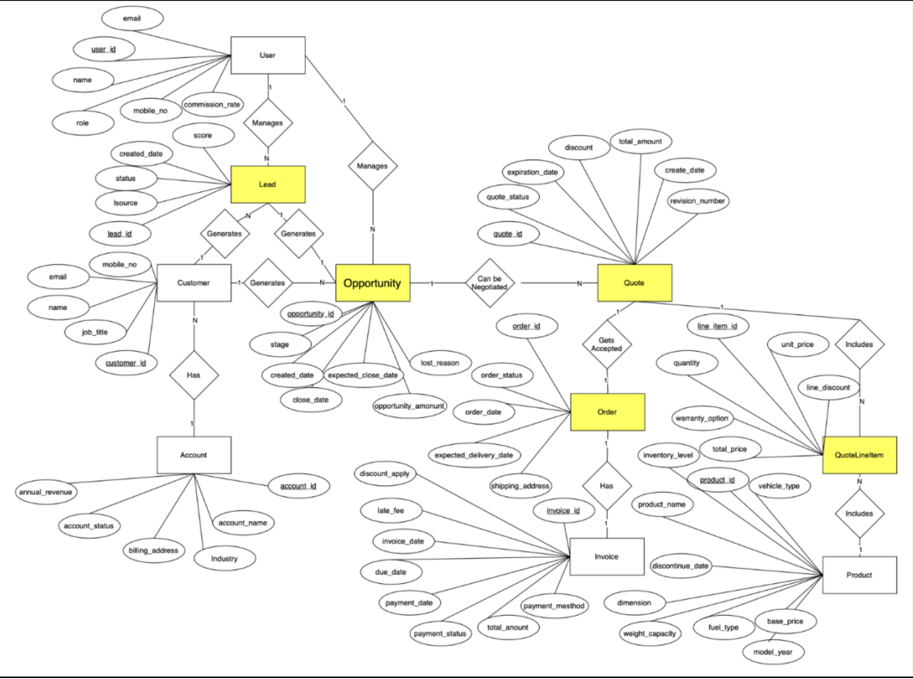

# GCV CRM — SQL Data Product

A relational CRM data product for a fictional commercial-vehicle manufacturer,
**Global Commercial Vehicles Inc. (GCV)**. It models the full B2B sales lifecycle
— **Lead → Opportunity → Quote → Order → Invoice** — over synthetic 2020–2022 data
across 10 UK cities, and generates business-insight reports in SQL.

> Originally a master's Data Management group project. This version has been
> **audited, re-normalised, and corrected** — see
> [`docs/VERIFICATION.md`](docs/VERIFICATION.md) for the full data-quality review.

## What was fixed
- **Referential integrity:** the original never enforced foreign keys, hiding
  1,160 orphan references (incl. a 100%-broken shipping-city link). The clean
  dataset loads with **FK enforcement on and zero violations**.
- **Normalisation:** 16 "lookup" tables stored one row per occurrence instead of
  per distinct value. They are now proper dimensions (e.g. Warranty 1,000 → 3).
- **Analytics:** revenue was double-counted **1.60×** by line-item joins
  (£115.7M → true **£72.4M**); queries corrected.

## Repository layout
```
GCV_SQL_Project/
├── data/
│   ├── raw/      # original export (preserved, as-submitted)
│   └── clean/    # re-normalised, FK-valid dataset (generated)
├── sql/
│   ├── schema.sql            # clean 3NF DDL (FK enforced)
│   ├── queries.sql           # corrected business queries
│   └── queries_advanced.sql  # window fns, CTEs, correlated subqueries
├── src/
│   ├── normalize.py          # raw  -> clean  (dedupe lookups, fix FKs, drop bad rows)
│   ├── build_db.py           # clean -> CRM.db (loads with FK enforcement, verifies)
│   ├── analysis.py           # core queries + charts
│   ├── analysis_advanced.py  # advanced queries + charts
│   └── render_erd.py         # regenerate ERD.png
├── reports/
│   ├── REPORT.md     # corrected insights write-up
│   └── figures/      # generated charts
└── docs/
    └── VERIFICATION.md
```

## Quick start
```bash
pip install -r requirements.txt
python src/normalize.py    # data/raw -> data/clean
python src/build_db.py     # build CRM.db (prints "Foreign-key check: PASS")
python src/analysis.py     # print results + write reports/figures/*.png
```

## Data model
A star-style schema: 15 dimension tables + a unified `City` dimension feed the
core entities (Account, Customer, Lead, Opportunity, Quote, QuoteLineItem, Order,
Invoice, Product, Users). Keys are `CHAR(8)` (3-letter table code + 5-digit
sequence). Full DDL in [`sql/schema.sql`](sql/schema.sql); ER diagram in
[`docs/erd.md`](docs/erd.md) (and [`ERD.png`](ERD.png)).



## Business questions answered
**Core** ([`sql/queries.sql`](sql/queries.sql)): quarterly sales by vehicle type ·
territory leaderboard · lead-source win rate · avg lead score by city · warranty mix.

**Advanced** ([`sql/queries_advanced.sql`](sql/queries_advanced.sql)) — window
functions, CTEs, correlated subqueries, date math:
1. Sales-rep leaderboard (revenue rank vs commission rank)
2. Revenue concentration / Pareto (cumulative window)
3. Sales funnel with stage drop-off
4. Win rate by discount band (does discounting buy wins?)
5. Sales-cycle length by lead source
6. Leads above their city average (correlated subquery)
7. Payment behaviour / DSO by method
8. Pipeline aging (stuck deals)

See [`reports/REPORT.md`](reports/REPORT.md) for findings and charts.

*Stack: Python (pandas, matplotlib) + SQLite.*
