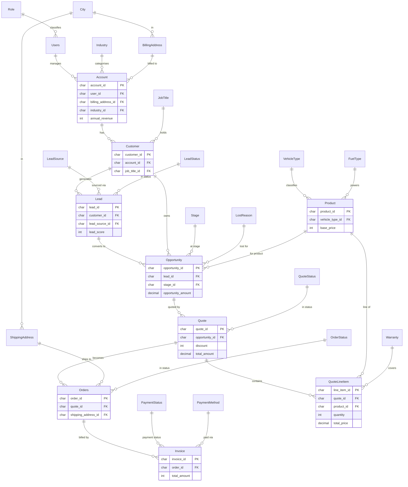

# Entity-Relationship Diagram

Re-normalised 3NF schema. GitHub renders the Mermaid diagram below natively; a
static image is also available at [`../ERD.png`](../ERD.png).

```mermaid
erDiagram
    Users ||--o{ Account : manages
    Role ||--o{ Users : classifies
    Industry ||--o{ Account : categorises
    BillingAddress ||--o{ Account : "billed to"
    City ||--o{ BillingAddress : in
    City ||--o{ ShippingAddress : in
    Account ||--o{ Customer : has
    JobTitle ||--o{ Customer : holds
    Customer ||--o{ Lead : generates
    LeadSource ||--o{ Lead : "sourced via"
    LeadStatus ||--o{ Lead : "in status"
    Lead ||--o{ Opportunity : "converts to"
    Customer ||--o{ Opportunity : owns
    Stage ||--o{ Opportunity : "at stage"
    LostReason ||--o{ Opportunity : "lost for"
    Product ||--o{ Opportunity : "for product"
    Opportunity ||--o{ Quote : "quoted by"
    QuoteStatus ||--o{ Quote : "in status"
    Quote ||--o{ Orders : "becomes"
    ShippingAddress ||--o{ Orders : "ships to"
    OrderStatus ||--o{ Orders : "in status"
    Orders ||--o{ Invoice : "billed by"
    PaymentStatus ||--o{ Invoice : "payment status"
    PaymentMethod ||--o{ Invoice : "paid via"
    Quote ||--o{ QuoteLineItem : contains
    Product ||--o{ QuoteLineItem : "line of"
    Warranty ||--o{ QuoteLineItem : covers
    VehicleType ||--o{ Product : classifies
    FuelType ||--o{ Product : powers

    Account {
        char account_id PK
        char user_id FK
        char billing_address_id FK
        char industry_id FK
        int annual_revenue
    }
    Customer {
        char customer_id PK
        char account_id FK
        char job_title_id FK
    }
    Lead {
        char lead_id PK
        char customer_id FK
        char lead_source_id FK
        int lead_score
    }
    Opportunity {
        char opportunity_id PK
        char lead_id FK
        char stage_id FK
        decimal opportunity_amount
    }
    Quote {
        char quote_id PK
        char opportunity_id FK
        int discount
        decimal total_amount
    }
    Orders {
        char order_id PK
        char quote_id FK
        char shipping_address_id FK
    }
    Invoice {
        char invoice_id PK
        char order_id FK
        int total_amount
    }
    QuoteLineItem {
        char line_item_id PK
        char quote_id FK
        char product_id FK
        int quantity
        decimal total_price
    }
    Product {
        char product_id PK
        char vehicle_type_id FK
        int base_price
    }
```
