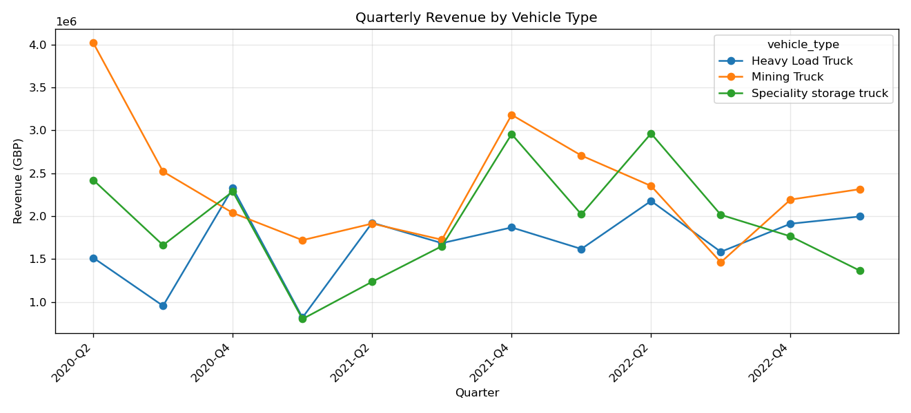
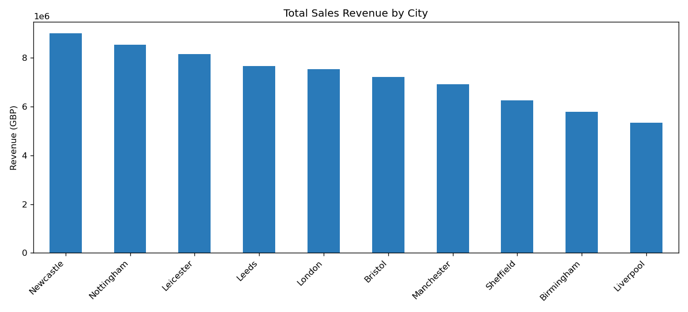
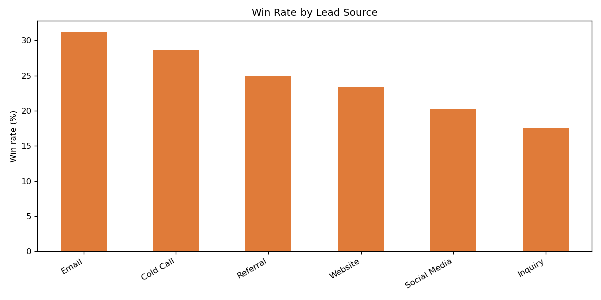
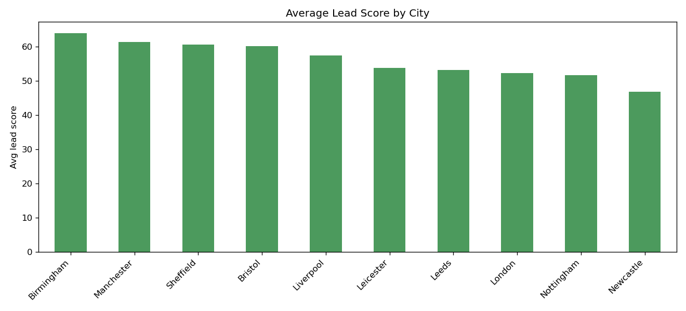

# GCV CRM — Business Insights Report (corrected)

**Global Commercial Vehicles Inc. (GCV)** is a B2B manufacturer of commercial
vehicles (heavy-load, mining and specialty-storage trucks). This CRM data product
tracks the sales lifecycle: **Lead → Opportunity → Quote → Order → Invoice**.

This report supersedes the original course submission. The numbers below are
recomputed on the cleaned, re-normalised dataset; see
[`../docs/VERIFICATION.md`](../docs/VERIFICATION.md) for what changed and why.
Period: synthetic data, **2020–2022**, 10 UK cities.

> **Note on the original figures.** The original report overstated revenue by
> **1.60×** (£115.7M vs the true £72.4M) because line-item joins multiplied
> invoice totals, and its regional report could not resolve cities due to a broken
> foreign key. Both are fixed here.

---

## 1. Quarterly sales by vehicle type
Revenue attributed at line-item grain (`QuoteLineItem.total_price`).

- **Mining Truck** leads revenue in most quarters; Heavy Load and Specialty
  Storage trade second place.
- Clear seasonality: Q2/Q4 peaks, softer Q1.

## 2. Territory sales leaderboard
Total invoiced revenue by shipping city (one invoice per order).

| Rank | City | Orders | Revenue (£) | Avg order value (£) |
|---|---|---|---|---|
| 1 | Newcastle | 82 | 9,004,647 | 108,490 |
| 2 | Nottingham | 80 | 8,533,627 | 106,670 |
| 3 | Leicester | 80 | 8,143,554 | 100,538 |
| 4 | Leeds | 73 | 7,662,896 | 104,971 |
| 5 | London | 70 | 7,529,098 | 106,044 |

Total across all cities: **£72,358,475** (matches total invoiced revenue exactly).

## 3. Lead source effectiveness (win rate)

| Lead source | Leads | Won | Win rate | Avg score |
|---|---|---|---|---|
| Email | 77 | 24 | **31.2%** | 57.6 |
| Cold Call | 84 | 24 | 28.6% | 55.1 |
| Referral | 84 | 21 | 25.0% | 54.1 |
| Website | 77 | 18 | 23.4% | 53.7 |
| Social Media | 89 | 18 | 20.2% | 51.3 |
| Inquiry | 85 | 15 | 17.6% | 57.3 |

**Email** and **Cold Call** convert best; **Inquiry** has high volume but the
lowest win rate — a candidate for budget reallocation.

## 4. Average lead score by city

Birmingham, Manchester and Sheffield carry the highest-quality leads (avg score
60+); Newcastle is lowest (46.8) despite strong revenue — a quality-vs-volume gap.

## 5. Warranty mix
Gold (3,691 units) and Platinum (3,612) dominate over Silver (2,684) — customers
skew toward premium warranty tiers.

---

*Reproduce: `python src/normalize.py && python src/build_db.py && python src/analysis.py`*
